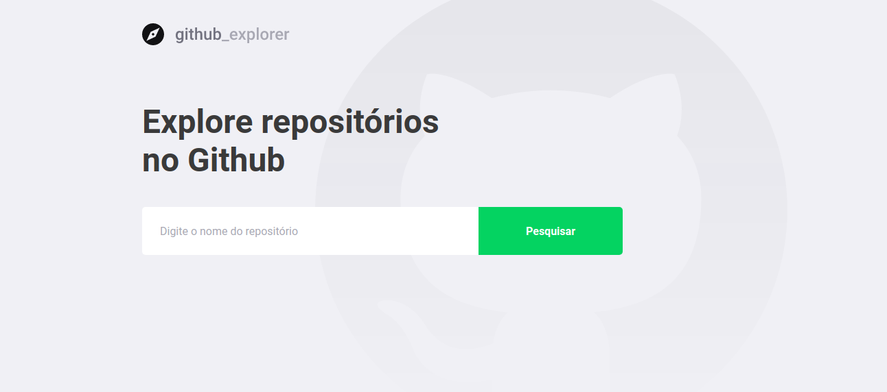
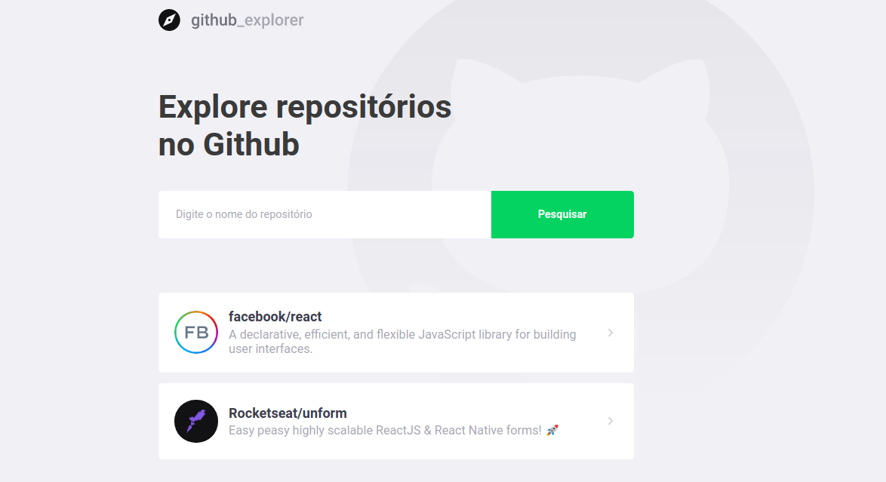
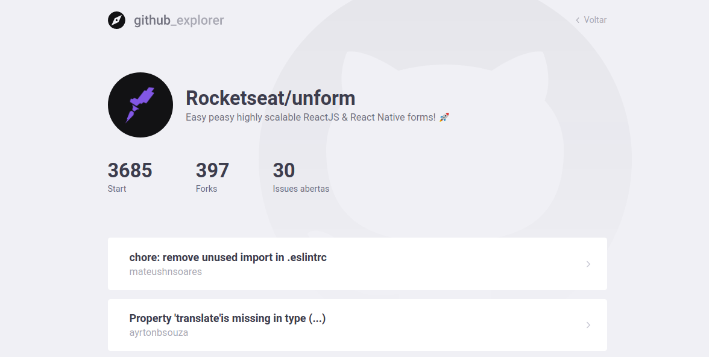

 🔎 Explore repositórios no Github

<h1 align="center">

  
  
  

</h1>

## Sobre este projeto

_" Explore repositórios no Github. Essa aplicação realiza busca de repositórios utilizando a API do Github. Projeto desenvolvido na aula do nível 03, do Bootcamp Gostack da Rocketseat."._

## ⚙️ Construído com

- [HTML](https://www.w3schools.com/html/)
- [CSS](https://www.w3schools.com/css/)
- [JAVASCRIPT](https://www.w3schools.com/js/)
- [REACT](https://pt-br.reactjs.org/)
- [TYPESCRIPT](https://www.typescriptlang.org/)

Rocketseat 💜
